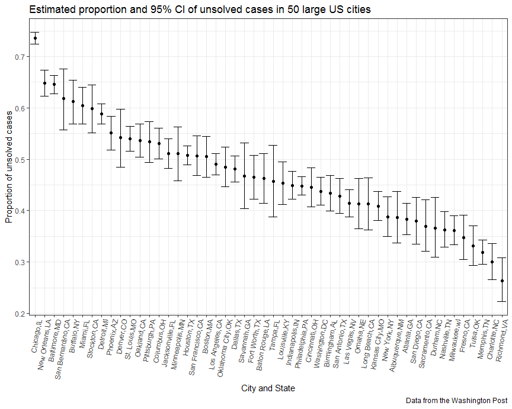

Homework 5
================

Problem 1
---------

### Import and tidy data

Create a tidy dataframe containing data from all participants:

First, start with a dataframe containing all file names and read in data:

``` r
longitudinal_df = 
  tibble(file_names = list.files("./data/")) %>% 
  mutate(subject_data = map(str_c("./data/", file_names), read_csv))
```

Then, tidy the dataset:

``` r
longitudinal_tidy = 
  longitudinal_df %>% 
  unnest %>% 
  mutate(file_names = str_replace(file_names, ".csv", "")) %>% 
  separate(file_names, into = c("arm", "subject_ID"), sep = "_") %>% 
  mutate(arm = str_replace(arm, "con", "control"),
         arm = str_replace(arm, "exp", "experimental")) %>% 
  gather(key = week, value = observation, week_1:week_8) %>% 
  mutate(week = str_replace(week, "week_", ""),
         week = as.integer(week)) %>% 
  arrange(arm, subject_ID)
```

Look at the resulting dataset:

``` r
longitudinal_tidy
```

    ## # A tibble: 160 x 4
    ##    arm     subject_ID  week observation
    ##    <chr>   <chr>      <int>       <dbl>
    ##  1 control 01             1        0.2 
    ##  2 control 01             2       -1.31
    ##  3 control 01             3        0.66
    ##  4 control 01             4        1.96
    ##  5 control 01             5        0.23
    ##  6 control 01             6        1.09
    ##  7 control 01             7        0.05
    ##  8 control 01             8        1.94
    ##  9 control 02             1        1.13
    ## 10 control 02             2       -0.88
    ## # ... with 150 more rows

``` r
str(longitudinal_tidy)
```

    ## Classes 'tbl_df', 'tbl' and 'data.frame':    160 obs. of  4 variables:
    ##  $ arm        : chr  "control" "control" "control" "control" ...
    ##  $ subject_ID : chr  "01" "01" "01" "01" ...
    ##  $ week       : int  1 2 3 4 5 6 7 8 1 2 ...
    ##  $ observation: num  0.2 -1.31 0.66 1.96 0.23 1.09 0.05 1.94 1.13 -0.88 ...

### Spaghetti plot

Make a spaghetti plot showing observations on each subject over time, and comment on differences between groups:

``` r
longitudinal_tidy %>% 
  mutate(ID = str_c(arm, "_", subject_ID)) %>% 
  ggplot(aes(x = week, y = observation, group = ID, color = arm)) + 
    geom_line() + 
    labs(
      title = "Observations on each subject over time",
      x = "Week",
      y = "Observation",
      caption = "Data from the longitudinal study"
    ) 
```


From the sphaghetti plot, the experimental group and control group had similar observations at baseline. However, the observations of subjects in experimental group are generally higher than observations of subjects in control group through 8 weeks. The difference between two groups increased over time since subjects assigned to the experimental arm had increasing observation values across weeks while subjects assigned to the control arm had relatively constant observation values.

I find this plot is clearer for comparing observations between groups than two-panel plot with each individual having different colors.

Problem 2
---------

### Import data

First, load and describe the row data:

``` r
homicide_df = read_csv("./homicide-data.csv")
homicide_df
```

    ## # A tibble: 52,179 x 12
    ##    uid   reported_date victim_last victim_first victim_race victim_age
    ##    <chr>         <int> <chr>       <chr>        <chr>       <chr>     
    ##  1 Alb-~      20100504 GARCIA      JUAN         Hispanic    78        
    ##  2 Alb-~      20100216 MONTOYA     CAMERON      Hispanic    17        
    ##  3 Alb-~      20100601 SATTERFIELD VIVIANA      White       15        
    ##  4 Alb-~      20100101 MENDIOLA    CARLOS       Hispanic    32        
    ##  5 Alb-~      20100102 MULA        VIVIAN       White       72        
    ##  6 Alb-~      20100126 BOOK        GERALDINE    White       91        
    ##  7 Alb-~      20100127 MALDONADO   DAVID        Hispanic    52        
    ##  8 Alb-~      20100127 MALDONADO   CONNIE       Hispanic    52        
    ##  9 Alb-~      20100130 MARTIN-LEY~ GUSTAVO      White       56        
    ## 10 Alb-~      20100210 HERRERA     ISRAEL       Hispanic    43        
    ## # ... with 52,169 more rows, and 6 more variables: victim_sex <chr>,
    ## #   city <chr>, state <chr>, lat <dbl>, lon <dbl>, disposition <chr>

The Washington Post homicide dataset contains 52179 observations, where each observation is a case of homicide.

There are 12 variables in this dataset:

uid: homicide identifier;
reported\_date: the date on which the killing was reported;
victim\_last: the last name of the victim;
victim\_first: the first name of the victim;
victim\_race: the race of the victim;
victim\_age: the age of the victim;
victim\_sex: the sex of the victim;
city, state, lat, lon: the location of the killing;
disposition: whether the case was closed and whether an arrest was made.

### Number of total and unsolved homicides

Create a city\_state variable and then summarize within cities to obtain the total number of homicides and the number of unsolved homicides:

``` r
homicide_city_state = 
  homicide_df %>%  
  mutate(city_state = str_c(city, ",", state)) 

homicide_number = 
  homicide_city_state %>% 
  group_by(city_state) %>%
  summarise(n_total = n(), 
            n_unsolved = sum(disposition %in% c("Closed without arrest", "Open/No arrest"))) %>% 
  filter(!(n_unsolved == 0))
homicide_number
```

    ## # A tibble: 50 x 3
    ##    city_state     n_total n_unsolved
    ##    <chr>            <int>      <int>
    ##  1 Albuquerque,NM     378        146
    ##  2 Atlanta,GA         973        373
    ##  3 Baltimore,MD      2827       1825
    ##  4 Baton Rouge,LA     424        196
    ##  5 Birmingham,AL      800        347
    ##  6 Boston,MA          614        310
    ##  7 Buffalo,NY         521        319
    ##  8 Charlotte,NC       687        206
    ##  9 Chicago,IL        5535       4073
    ## 10 Cincinnati,OH      694        309
    ## # ... with 40 more rows

I created a dataset called homicide\_city\_state containing a city\_state variable, and then group by city\_state and summarise to obtain the resulting dataframe.

For the city of Baltimore, MD:

First, estimate the proportion of homicides that are unsolved.

``` r
baltimore_data = 
  homicide_number %>% 
  filter(city_state == "Baltimore,MD") 
prop.test(baltimore_data$n_unsolved, baltimore_data$n_total)
```

    ## 
    ##  1-sample proportions test with continuity correction
    ## 
    ## data:  baltimore_data$n_unsolved out of baltimore_data$n_total, null probability 0.5
    ## X-squared = 239.01, df = 1, p-value < 2.2e-16
    ## alternative hypothesis: true p is not equal to 0.5
    ## 95 percent confidence interval:
    ##  0.6275625 0.6631599
    ## sample estimates:
    ##         p 
    ## 0.6455607

Then, save the output of prop.test as an R object, apply the broom::tidy to this object and pull the estimated proportion and confidence intervals from the resulting tidy dataframe.

``` r
baltimore_prop_tidy = 
  prop.test(baltimore_data$n_unsolved, baltimore_data$n_total) %>% 
  broom::tidy() %>% 
  janitor::clean_names()
baltimore_prop_tidy
```

    ## # A tibble: 1 x 8
    ##   estimate statistic  p_value parameter conf_low conf_high method
    ##      <dbl>     <dbl>    <dbl>     <int>    <dbl>     <dbl> <chr> 
    ## 1    0.646      239. 6.46e-54         1    0.628     0.663 1-sam~
    ## # ... with 1 more variable: alternative <chr>

``` r
baltimore_prop_tidy %>% 
  select(estimate, conf_low, conf_high) %>% 
  rename(Estimate = estimate, 
         "Lower limit" = conf_low, 
         "Upper limit" = conf_high) %>% 
  knitr::kable()
```

|   Estimate|  Lower limit|  Upper limit|
|----------:|------------:|------------:|
|  0.6455607|    0.6275625|    0.6631599|

From the resulting dataframe and the above table, the estimated proportion of homicides that are unsolved in Baltimore is 0.646, and the 95% confidence interval is (0.628, 0.663).

Create a tidy dataframe with estimated proportions of unsolved homicides and CIs for each city:

``` r
prop_tidy = function(df){
  prop_test = prop.test(df$n_unsolved, df$n_total)
  broom::tidy(prop_test)
}

city_state_nest = nest(homicide_number, n_total:n_unsolved)

prop_ci = 
  city_state_nest %>% 
  mutate(prop_unsolved = map(data, prop_tidy)) %>% 
  unnest() %>% 
  janitor::clean_names() %>% 
  select(city_state, estimate, conf_low, conf_high)
prop_ci
```

    ## # A tibble: 50 x 4
    ##    city_state     estimate conf_low conf_high
    ##    <chr>             <dbl>    <dbl>     <dbl>
    ##  1 Albuquerque,NM    0.386    0.337     0.438
    ##  2 Atlanta,GA        0.383    0.353     0.415
    ##  3 Baltimore,MD      0.646    0.628     0.663
    ##  4 Baton Rouge,LA    0.462    0.414     0.511
    ##  5 Birmingham,AL     0.434    0.399     0.469
    ##  6 Boston,MA         0.505    0.465     0.545
    ##  7 Buffalo,NY        0.612    0.569     0.654
    ##  8 Charlotte,NC      0.300    0.266     0.336
    ##  9 Chicago,IL        0.736    0.724     0.747
    ## 10 Cincinnati,OH     0.445    0.408     0.483
    ## # ... with 40 more rows

I wrote a function called prop\_tidy that runs prop.test for each of the cities, saves the result to an object called prop\_test and then applys the broom::tidy to this object. I created a dataframe containing a list column. Then I used map to iterate over the list column and finally created a tidy dataframe with estimated proportions and CIs for each city.

### Errorbar plot

Create a plot that shows the estimates and CIs for each city:

``` r
prop_ci %>% 
  mutate(city_state = fct_reorder(city_state, desc(estimate))) %>% 
  ggplot(aes(x = city_state, y = estimate)) +
  geom_point() +
  geom_errorbar(aes(ymin = conf_low, ymax = conf_high)) +
  theme(axis.text.x = element_text(angle = 80, hjust = 1)) +
  labs(title = "Estimated proportion and 95% CI of unsolved cases in 50 large US cities", 
       y = "Proportion of unsolved cases", 
       x = "City and State", 
       caption = "Data from the Washington Post") 
```



The above plot shows the estimate and 95% CI of proportion of unsolved homicides for each city, ordered from most to least. Chicago has the highest proportion of unsolved cases, while Richmond has the lowest proportion of unsolved cases.
