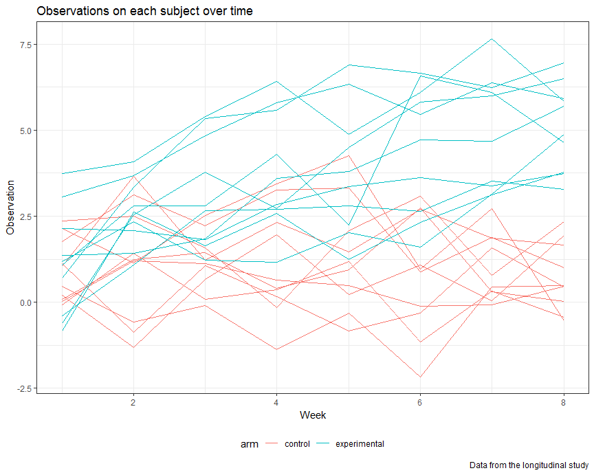

Homework 5
================

Problem 1
---------

Create a tidy dataframe containing data from all participants:

First, start with a dataframe containing all file names and read in data:

``` r
longitudinal_df = 
  tibble(file_names = list.files("./data/")) %>% 
  mutate(subject_data = map(str_c("./data/", file_names), read_csv))
```

Then, tidy the dataset:

``` r
longitudinal_tidy = 
  longitudinal_df %>% 
  unnest %>% 
  mutate(file_names = str_replace(file_names, ".csv", "")) %>% 
  separate(file_names, into = c("arm", "subject_ID"), sep = "_") %>% 
  mutate(arm = str_replace(arm, "con", "control"),
         arm = str_replace(arm, "exp", "experimental")) %>% 
  gather(key = week, value = observation, week_1:week_8) %>% 
  mutate(week = str_replace(week, "week_", ""),
         week = as.integer(week)) %>% 
  arrange(arm, subject_ID)
```

Look at the resulting dataset:

``` r
longitudinal_tidy
```

    ## # A tibble: 160 x 4
    ##    arm     subject_ID  week observation
    ##    <chr>   <chr>      <int>       <dbl>
    ##  1 control 01             1        0.2 
    ##  2 control 01             2       -1.31
    ##  3 control 01             3        0.66
    ##  4 control 01             4        1.96
    ##  5 control 01             5        0.23
    ##  6 control 01             6        1.09
    ##  7 control 01             7        0.05
    ##  8 control 01             8        1.94
    ##  9 control 02             1        1.13
    ## 10 control 02             2       -0.88
    ## # ... with 150 more rows

``` r
str(longitudinal_tidy)
```

    ## Classes 'tbl_df', 'tbl' and 'data.frame':    160 obs. of  4 variables:
    ##  $ arm        : chr  "control" "control" "control" "control" ...
    ##  $ subject_ID : chr  "01" "01" "01" "01" ...
    ##  $ week       : int  1 2 3 4 5 6 7 8 1 2 ...
    ##  $ observation: num  0.2 -1.31 0.66 1.96 0.23 1.09 0.05 1.94 1.13 -0.88 ...

Make a spaghetti plot showing observations on each subject over time, and comment on differences between groups:

``` r
longitudinal_tidy %>% 
  mutate(ID = str_c(arm, "_", subject_ID)) %>% 
  ggplot(aes(x = week, y = observation, group = ID, color = arm)) + 
    geom_line() + 
    labs(
      title = "Observations on each subject over time",
      x = "Week",
      y = "Observation",
      caption = "Data from the longitudinal study"
    ) 
```



From the sphaghetti plot, the experimental group and control group had similar observations at baseline. However, the observations of subjects in experimental group are generally higher than observations of subjects in control group through 8 weeks. The difference between two groups increased over time since subjects assigned to the experimental arm had increasing observation values across weeks while subjects assigned to the control arm had relatively constant observation values.

Problem 2
---------

First, load and describe the row data:

``` r
homicide_df = read_csv("./homicide-data.csv")
homicide_df
```

    ## # A tibble: 52,179 x 12
    ##    uid   reported_date victim_last victim_first victim_race victim_age
    ##    <chr>         <int> <chr>       <chr>        <chr>       <chr>     
    ##  1 Alb-~      20100504 GARCIA      JUAN         Hispanic    78        
    ##  2 Alb-~      20100216 MONTOYA     CAMERON      Hispanic    17        
    ##  3 Alb-~      20100601 SATTERFIELD VIVIANA      White       15        
    ##  4 Alb-~      20100101 MENDIOLA    CARLOS       Hispanic    32        
    ##  5 Alb-~      20100102 MULA        VIVIAN       White       72        
    ##  6 Alb-~      20100126 BOOK        GERALDINE    White       91        
    ##  7 Alb-~      20100127 MALDONADO   DAVID        Hispanic    52        
    ##  8 Alb-~      20100127 MALDONADO   CONNIE       Hispanic    52        
    ##  9 Alb-~      20100130 MARTIN-LEY~ GUSTAVO      White       56        
    ## 10 Alb-~      20100210 HERRERA     ISRAEL       Hispanic    43        
    ## # ... with 52,169 more rows, and 6 more variables: victim_sex <chr>,
    ## #   city <chr>, state <chr>, lat <dbl>, lon <dbl>, disposition <chr>

The Washington Post homicide dataset contains 52179 observations, where each observation is a case of homicide.

There are 12 variables in this dataset:

uid: homicide identifier;
reported\_date: the date on which the killing was reported;
victim\_last: the last name of the victim;
victim\_first: the first name of the victim;
victim\_race: the race of the victim;
victim\_age: the age of the victim;
victim\_sex: the sex of the victim;
city, state, lat, lon: the location of the killing;
disposition: whether the case was closed and whether an arrest was made.

Create a city\_state variable and then summarize within cities to obtain the total number of homicides and the number of unsolved homicides:

``` r
homicide_city_state = 
  homicide_df %>%  
  mutate(city_state = str_c(city, ",", state)) 

homicide_number = 
  homicide_city_state %>% 
  group_by(city_state) %>%
  summarise(n_total = n(), 
            n_unsolved = sum(disposition %in% c("Closed without arrest", "Open/No arrest"))) %>% 
  filter(!(n_unsolved == 0))
homicide_number
```

    ## # A tibble: 50 x 3
    ##    city_state     n_total n_unsolved
    ##    <chr>            <int>      <int>
    ##  1 Albuquerque,NM     378        146
    ##  2 Atlanta,GA         973        373
    ##  3 Baltimore,MD      2827       1825
    ##  4 Baton Rouge,LA     424        196
    ##  5 Birmingham,AL      800        347
    ##  6 Boston,MA          614        310
    ##  7 Buffalo,NY         521        319
    ##  8 Charlotte,NC       687        206
    ##  9 Chicago,IL        5535       4073
    ## 10 Cincinnati,OH      694        309
    ## # ... with 40 more rows

I created a dataset called homicide\_city\_state containing a city\_state variable, and then group by city\_state and summarise to obtain the resulting dataframe.
